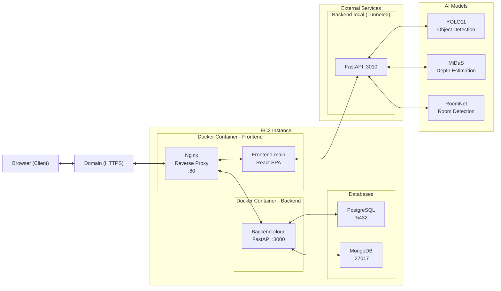

## IjipMatjip

 사용자 조건에 맞는 매물을 AI가 추천하고, 방 사진으로 공간 크기를 추정해 3D 가구 배치와 스타일별 AI 인테리어 이미지를 제공하며, 상세 분석 리포트와 주변 인프라 정보까지 한 번에 보여주는 통합형 부동산 웹 앱입니다.

### 핵심 모듈
- `frontend-main`: 메인 웹 프론트엔드 (React + Vite + Tailwind + Three.js)
- `eunbi/room-measure/backend-local`: 로컬 이미지/AI 처리 API (FastAPI, OpenCV)
- `eunbi/room-measure/backend-cloud`: 클라우드 데이터 API (FastAPI) — 회원/레이아웃 저장·조회
- `eunbi/room-measure/frontend`: 실험적/보조 프론트엔드 (선택)

### 주요 기능

| 구분 | 기능 | 설명 |
|:---:|:---|:---|
| 01 | 방사진으로 크기측정 | 사진만으로 방 사이즈를 측정 |
| 02 | 2D평면도, 3D 공간 생성 | 방 사진을 기반으로 2D 평면도와 3D 공간 모델을 자동 생성 |
| 03 | 가구배치 시뮬레이션 | 3D 환경에서 가구를 드래그하여 배치하고 실시간으로 공간 활용도 확인 |
| 04 | 스타일별 AI 방이미지 제작 | 선택한 스타일에 따라 AI가 인테리어 이미지를 생성하여 미래의 방 모습 미리보기 |
| 05 | 상세분석 리포트 | 방의 크기, 가구 배치, 공간 활용도 등을 종합적으로 분석한 상세 리포트 제공 |
| 06 | 사용자 맞춤 인프라 | 주변 마트, 병원, 지하철, 공원 등 생활 인프라 정보를 지도 기반으로 제공 |

**상세 기능 설명:**
- 방 사진 업로드 후 4포인트 클릭으로 가로/세로 길이 추정 (광각 왜곡 보정 포함)
- 3D 캔버스에서 가구 드래그/회전/스냅, 벽/창문 표시, 격자/조명 토글
- 창문 감지, 깊이맵 생성/조회, 방 크기 추정 등 로컬 처리 API 연동
- AI 인테리어 이미지 생성(스타일 선택) 및 결과 다운로드/목록 조회
- 회원 가입/로그인, 방 레이아웃 저장/조회(게스트 저장도 지원)
- 매물 추천: 사용자 조건(선호도/지역/거래유형/예산/평수/방유형) 기반으로 AI가 동네·매물을 추천하고, 동네별 카드 그리드/필터 제공. 동일 조건 재조회 시 sessionStorage 캐싱 활용.
- 매물 상세: 이미지 갤러리(썸네일 선택), 지도 기반 주변 인프라(마트/병원/지하철/공원) 집계, AI 심층 분석 리포트(요약·점수·가격평가·장단점·체크포인트) 표시, 선택 이미지로 `Room Planner` 연동(해당 사진으로 방 측정하기).

### 기술 스택
- Frontend: React 18, Vite, Tailwind CSS, React Router, Three.js(@react-three/fiber, @react-three/drei)
- Backend-local(이미지/AI 처리): FastAPI 0.116+, OpenCV, PIL, PyTorch, Ultralytics(YOLO11), MiDaS(깊이 추정), NumPy, scikit-learn, 패키지 관리자 uv
- Backend-cloud(클라우드 데이터): FastAPI 0.116+, PostgreSQL, MongoDB, 인증(JWT + bcrypt), 패키지 관리자 uv, 배포(Docker + EC2)
- 프론트엔드 배포: Docker(멀티스테이지) + Nginx 정적 호스팅
- CI/CD: GitHub Actions (워크플로우 기반 자동 빌드/배포)

### 아키텍처
실제 배포 환경에서는 프론트엔드와 백엔드 클라우드는 Docker로 컨테이너화되어 도메인으로 접근 가능하며, 백엔드 로컬은 터널링을 통해 외부에서 접근할 수 있습니다.



배포 환경 구성

| 구성요소 | 배포 방식 | 포트 | 역할 |
|---|---:|---|
| Frontend-main | Docker (Nginx) | 80 | React SPA 정적 호스팅 |
| Backend-cloud | Docker (FastAPI) | 3000 | 인증/레이아웃/좌표변환 |
| Backend-local | 터널링 (ngrok/cloudflared) | 3010 | 이미지 처리/깊이/감지/방측정 |
| PostgreSQL | EC2 내부 | 5432 | 사용자 등 관계형 데이터 |
| MongoDB | EC2 내부 | 27017 | 방 레이아웃 등 도큐먼트 저장 |

### 시스템 요구사항 요약
- Python: 3.12 이상 (local/cloud 백엔드 모두)
- Node: 18 이상 (프론트엔드)
- 메모리: 2–4GB 권장(모델 로딩 및 이미지 처리 시)
- 데이터베이스: PostgreSQL, MongoDB (cloud 백엔드)

### 환경 변수 요약
- 프론트엔드(`frontend-main/.env`)
  - `VITE_LOCAL_API_BASE`: 로컬 처리 API 기본 URL (예: http://localhost:3010)
  - `VITE_CLOUD_API_BASE`: 클라우드 API 기본 URL (예: http://localhost:3000)
  - `VITE_AI_INTERIOR_API_BASE`: AI 인테리어 API URL이 필요한 경우 사용
  - 선택: `VITE_GEMINI_API_KEY`, `VITE_EUNBI_API_URL`, `VITE_MINAH_API_URL`, `VITE_DANBI_API_URL`
- 클라우드 백엔드(`eunbi/room-measure/backend-cloud/.env`)
  - JWT, PostgreSQL, MongoDB 접속 정보, 로그/환경 변수 등 (`.env.example` 참고)

### API 엔드포인트 하이라이트
- 로컬 처리 API(권장 경로)
  - `/processing/undistort`, `/processing/depth-map`, `/processing/depth-map-image`
  - `/processing/depth-at-point`, `/processing/depth-meta`, `/processing/depth-distance`
  - `/detection/auto-detect-room`, `/detection/estimate-room-size`, `/detection/detect-windows`
- 클라우드 API(권장 경로)
  - 인증: `/auth/signup`, `/auth/login`, `/auth/me`
  - 레이아웃: `/layouts/save`, `/layouts/save-guest`, `/layouts/`(목록), `/layouts/guest`, `/layouts/{id}`
  - 변환: `/layouts/convert-furniture-coordinates`
  - 레거시 경로는 README를 참고하여 하위호환 유지

### API 예시 요청/응답
- 로컬 처리 — 이미지 왜곡 보정(레거시 경로)
```bash
curl -X POST \
  -F "file=@test_image.jpg" \
  http://localhost:3010/undistort \
  -o undistorted.jpg
# 응답: 이미지 바이너리 (파일 저장)
```

- 로컬 감지 — 방 크기 측정(권장 경로)
```bash
curl -X POST http://localhost:3010/detection/estimate-room-size \
  -H "Content-Type: application/json" \
  -d '{
    "points": [[120,340],[120,80],[40,380],[220,380]],
    "target_height": 2.3
  }'
# 예시 응답
{
  "width_cm": 320,
  "depth_cm": 260,
  "height_cm": 230,
  "scale_cm_per_px": 0.45
}
```

### CI/CD (GitHub Actions)
- 워크플로우 위치: `.github/workflows/`

- 프론트엔드 자동 배포 — `deploy-frontend-main.yml`
  - 트리거: `integration` 브랜치로 푸시(경로: `frontend-main/**`) 또는 수동 실행
  - 동작:
    - Docker Hub 로그인 → `frontend-main` 이미지 빌드/푸시(`eunbie/frontend-main:${GITHUB_SHA}`)
    - 빌드 인자: `VITE_LOCAL_API_BASE`, `VITE_CLOUD_API_BASE`, `VITE_AI_INTERIOR_API_BASE`, `VITE_GEMINI_API_KEY` (GitHub Secrets에서 주입)
    - EC2 배포(SSH): 컨테이너 실행(`-p 80:80`), `curl http://localhost` 헬스체크

- 백엔드(클라우드) 자동 배포 — `deploy-backend-cloud.yml`
  - 트리거: `dev-eunbi` 브랜치로 푸시(경로: `eunbi/room-measure/backend-cloud/**`) 또는 수동 실행
  - 동작:
    - Docker Hub 로그인 → `room-measure-cloud` 이미지 빌드/푸시(`eunbie/room-measure-cloud:${GITHUB_SHA}`)
    - EC2 배포(SSH): `.env` 존재 확인(없으면 `.env.example`로 생성 경고), `git pull origin dev-eunbi` 후 컨테이너 실행(`-p 3000:3000`)
    - 헬스체크: `http://localhost:3000/health` 최대 3회 재시도

- GitHub Secrets (예시)
  - `EUNBI_DOCKERHUB_USERNAME`, `EUNBI_DOCKERHUB_TOKEN`
  - `EUNBI_NODE_EC2_HOST`, `EUNBI_NODE_EC2_SSH_KEY`
  - `VITE_LOCAL_API_BASE`, `VITE_CLOUD_API_BASE`, `VITE_AI_INTERIOR_API_BASE`, `VITE_GEMINI_API_KEY`

- 수동 실행: GitHub → Actions → 해당 워크플로우 → Run workflow

- 브랜치 정책(현재 구성)
  - 프론트엔드 배포: `integration` 브랜치 푸시 시 트리거
  - 백엔드(클라우드) 배포: `dev-eunbi` 브랜치 푸시 시 트리거

- 클라우드 인증 — 로그인(권장 경로)
```bash
curl -X POST http://localhost:3000/auth/login \
  -H "Content-Type: application/json" \
  -d '{"email":"user@example.com","password":"secret"}'
# 예시 응답
{
  "access_token": "<JWT>",
  "token_type": "bearer",
  "user": {"id": 1, "email": "user@example.com"}
}
```

- 클라우드 레이아웃 — 게스트 저장(권장 경로)
```bash
curl -X POST http://localhost:3000/layouts/save-guest \
  -H "Content-Type: application/json" \
  -d '{
    "scene": {
      "room": {"width": 320, "depth": 260, "height": 230},
      "objects": [ {"id":"bed-1","type":"bed","position":[1.2,0,0.8]} ]
    }
  }'
# 예시 응답
{
  "success": true,
  "layout_id": "665f2c...",
  "saved_at": "2025-01-01T12:00:00Z"
}
```

### 빠른 시작 (개발)
사전 요구: Node 18+, Python 3.10+

1) 백엔드 기동
- 로컬 처리 API (창문/깊이/방측정 등, 3010 포트)
```bash
cd eunbi/room-measure/backend-local
uvicorn main:app --host 0.0.0.0 --port 3010
```
- 클라우드 API (회원/레이아웃, 3000 포트)
```bash
cd eunbi/room-measure/backend-cloud
uvicorn main:app --host 0.0.0.0 --port 3000
```

2) 프론트엔드 환경변수 (`frontend-main/.env`)
```bash
VITE_LOCAL_API_BASE=http://localhost:3010
VITE_CLOUD_API_BASE=http://localhost:3000

3) 프론트엔드 실행
```bash
cd frontend-main
npm install
npm run dev
# http://localhost:4000
```

### Docker (프론트엔드)
`frontend-main`는 Docker 빌드-런 구성이 포함되어 있습니다.
```bash
cd frontend-main
docker build \
  --build-arg VITE_LOCAL_API_BASE=http://localhost:3010 \
  --build-arg VITE_CLOUD_API_BASE=http://localhost:3000 \
  -t ijip-frontend .

docker run --rm -p 8080:80 ijip-frontend
# http://localhost:8080
```

### 주요 경로 요약
- 프론트엔드 진입: `frontend-main/src/main.jsx` → `frontend-main/src/App.jsx`
- 라우트: `/`, `/room-planner`, `/ai-interior`, `/find-house`, `/recommend`, `/detail/:propertyId`, `/category`, `/login`, `/signup`
- API 유틸: `frontend-main/src/utils/api.js` (환경변수 `VITE_*` 기반)
- 개발 서버 포트: 4000 (Vite)
- Nginx 설정: `frontend-main/nginx.conf` (SPA fallback/캐시/보안 헤더)

