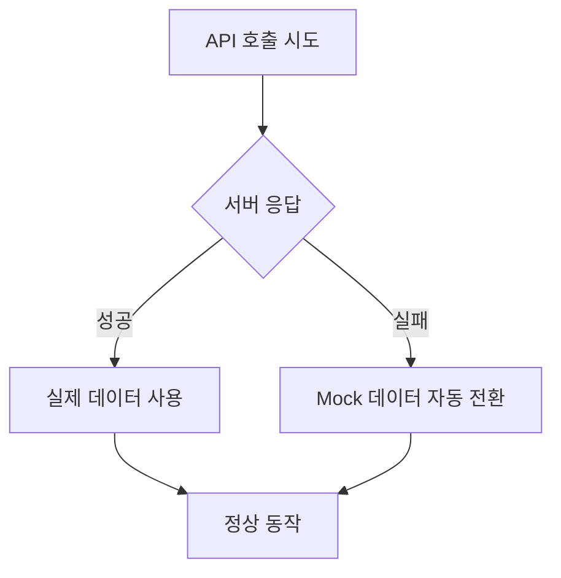

# Mock 데이터 시스템 사용법

## 개요

팀원 백엔드 서버(`https://dev-bidanee.site`)가 다운되었을 때 자동으로 Mock 데이터로 전환하여 개발을 지속할 수 있는 시스템입니다.

## 자동 전환 방식

### **방법 1: 서버 상태 자동 감지** (현재 적용됨)

```javascript
try {
  // 1. 실제 API 먼저 시도
  const response = await client.post('/api/recommend/neighborhood', searchConditions);
  console.log("실제 API 데이터 사용 성공");
  setData(response.data);
  
} catch (error) {
  // 2. API 실패하면 자동으로 Mock 데이터 사용
  console.log("서버 연결 실패, Mock 데이터로 자동 전환");
  setData(mockData);
}
```

### **동작 시나리오**



## 파일 구조

```
frontend-main/
├── src/
│   ├── utils/
│   │   └── mockData.js         # Mock 데이터 정의
│   ├── pages/
│   │   ├── RecommendationPage.jsx  # 자동 전환 적용됨
│   │   └── DetailPage.jsx          # 자동 전환 적용됨
│   └── api/
│       └── client.js           # 팀원 백엔드 설정
└── MOCK_DATA_SYSTEM.md         # 이 문서
```

## 적용된 페이지

### 1. **RecommendationPage**
- **API**: `/api/recommend/neighborhood`
- **Mock 데이터**: `mockRecommendations`, `mockEstates`
- **동작**: 서버 다운 시 자동으로 Mock 추천 데이터 표시

### 2. **DetailPage**
- **API**: `/api/infrastructure`, `/api/report/generate`, `/api/geocode`, `/api/commute-details`
- **Mock 데이터**: `mockInfrastructure`, `mockAIReport`, `mockCommuteDetails`
- **동작**: 서버 다운 시 자동으로 Mock 상세 정보 표시

## Mock 데이터 내용

### `mockEstateData`
```javascript
{
  id: 1,
  photo_url: "실제 이미지 URL",
  address: "서울시 강남구 역삼동 123-45",
  room_type: "원룸",
  deal_type: "월세",
  price_deposit: 1000,
  price_rent: 50,
  // ... 기타 매물 정보
}
```

### `mockAIReport`
```javascript
{
  fit_score: 85,
  summary: "AI 한줄 총평",
  price_analysis: { evaluation: "적정", comment: "..." },
  pros: ["장점1", "장점2"],
  cons: ["고려사항1", "고려사항2"],
  check_points: ["체크포인트1", "체크포인트2"]
}
```

## 서버 복구 시 자동 전환

### **서버 상태별 동작**

| 서버 상태 | 동작 | 로그 |
|-----------|------|------|
| **정상** | 실제 API 사용 | `실제 API 데이터 사용 성공` |
| **다운** | Mock 데이터 사용 | `서버 연결 실패, Mock 데이터로 자동 전환` |

### **전환 과정**

1. **서버 복구 전**: Mock 데이터로 개발/테스트
2. **서버 복구 후**: 새로고침 시 자동으로 실제 API 사용
3. **코드 수정 불필요**: 환경 변화에 자동 적응

## 개발자 안내

### **새로운 페이지에 적용하는 방법**

1. **Mock 데이터 추가**
```javascript
// src/utils/mockData.js에 추가
export const mockNewPageData = {
  // 실제 API 응답과 동일한 구조로 작성
};
```

2. **컴포넌트에서 사용**
```javascript
import { mockNewPageData } from '../utils/mockData';

const fetchData = async () => {
  try {
    const response = await client.post('/api/new-endpoint', payload);
    setData(response.data);
  } catch (error) {
    console.log("서버 연결 실패, Mock 데이터로 자동 전환");
    setData(mockNewPageData);
  }
};
```

### **주의사항**

1. **Mock 데이터 구조**: 실제 API 응답과 동일하게 작성
2. **에러 로깅**: 실제 서버 오류도 함께 로그에 기록
3. **캐시 처리**: Mock 데이터도 캐시에 저장하여 일관성 유지
4. **개발 편의성**: 콘솔에 현재 사용 중인 데이터 소스 표시

## 장점

### **개발 생산성**
- 백엔드 서버 상태와 무관하게 개발 지속
- 팀원 간 의존성 최소화
- 안정적인 테스트 환경

### **자동화**
- 코드 수정 없이 서버 상태에 따라 자동 전환
- 환경변수 설정 불필요
- 배포 시에도 동일하게 작동

### **유지보수성**
- Mock 데이터 중앙 관리
- 실제 API와 동일한 구조 유지
- 서버 복구 시 즉시 실제 데이터로 전환

## 트러블슈팅

### **Q: Mock 데이터가 표시되지 않아요**
A: 브라우저 콘솔에서 `서버 연결 실패, Mock 데이터로 자동 전환` 메시지 확인

### **Q: 서버가 복구되었는데 여전히 Mock 데이터가 나와요**
A: 브라우저 새로고침 또는 캐시 삭제 후 재시도

### **Q: 새로운 API에 Mock 시스템 적용하고 싶어요**
A: 위의 "새로운 페이지에 적용하는 방법" 참조

## 변경 이력

- **2025-08-23**: 초기 Mock 시스템 구현
  - RecommendationPage 자동 전환 적용
  - DetailPage 자동 전환 적용
  - mockData.js 파일 생성
  - 자동 감지 로직 구현

---

**문의**: 이 시스템에 대한 질문이 있으시면 언제든 문의해주세요!