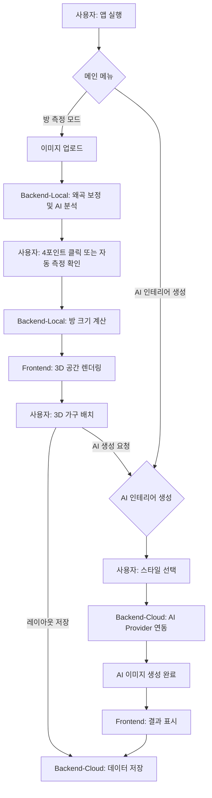

# SW개발 설계서

**프로젝트명**: 이집맛집(IjipMatjip) - AI 기반 부동산 인테리어 시뮬레이션 플랫폼

---

## 1. 요구사항 정의서

| 구분 | 기능 | 설명 |
| :--- | :--- | :--- |
| **S/W** | **사용자 기능** | |
| | 1. 방 이미지 업로드 | 사용자가 부동산 방 사진을 업로드하여 분석을 시작할 수 있다. |
| | 2. 방 크기 자동 측정 | AI 또는 4포인트 클릭 방식으로 방의 가로/세로 길이를 자동 계산한다. |
| | 3. 3D 공간 시각화 | Three.js를 활용하여 측정된 방 크기를 3D 공간으로 렌더링한다. |
| | 4. 실시간 가구 배치 | 드래그앤드롭 방식으로 3D 가구를 실시간으로 배치하고 이동/회전할 수 있다. |
| | 5. AI 인테리어 생성 | Stability AI, Replicate, Vertex AI를 활용하여 스타일 기반 인테리어 이미지를 생성한다. |
| | 6. 레이아웃 저장/불러오기 | 완성된 방 레이아웃을 저장하고 나중에 불러올 수 있다. |
| | **백엔드 시스템 기능** | |
| | 7. 광각 왜곡 보정 | cv2.undistort() 함수를 통해 광각 카메라로 촬영된 이미지의 왜곡을 1차 보정한다. |
| | 8. 깊이 맵 생성 | 단일 2D 이미지로부터 깊이 정보를 추출하여 3D 공간을 추론한다. |
| | 9. 창문/방 경계 자동 감지 | YOLO, RoomNet 등 AI 모델을 활용하여 방 이미지에서 주요 구조를 자동으로 탐지한다. |
| | 10. 가구 배치 보존 | '하이브리드 입력 이미지' 기술을 통해 원본 배치를 유지하며 스타일만 변경한다. |
| | 11. 사용자 인증 | 회원가입/로그인을 통해 개인별 레이아웃을 관리한다. |
| | 12. 가구 충돌 감지 | 가구 간 충돌을 감지하여 현실적인 배치만 허용한다. |
| | 13. 3D 스크린샷 캡처 | 가구 배치 완료 후 3D 뷰를 스크린샷으로 저장할 수 있다. |
| | 14. 반응형 웹 디자인 | 모바일, 태블릿, 데스크톱 모든 환경에서 최적화된 UI를 제공한다. |
| **H/W** | **서버 요구사항** | |
| | 15. 고성능 GPU 지원 | AI 이미지 생성을 위한 GPU 가속 처리를 지원한다. |
| | 16. 멀티 플랫폼 지원 | Windows, macOS, Linux 환경에서 서버를 운영할 수 있다. |

---

## 2. 서비스 구성도 - 서비스 시나리오

### 하이브리드 아키텍처 구성

```
로컬 환경 (사용자 PC)              클라우드 환경 (AWS EC2)
┌─────────────────────────┐     ┌─────────────────────────┐
│   Backend-Local         │     │   Backend-Cloud        │
│   (포트: 3010)          │────▶│   (포트: 3000)         │
│                         │     │                        │
│   • AI 이미지 처리      │     │   • 사용자 인증        │
│   • 방 크기 측정        │     │   • 데이터 저장        │
│   • 창문 감지           │     │   • 레이아웃 관리      │
│   • YOLO, MiDaS 모델    │     │                        │
│   • OpenCV 처리         │     │   Frontend             │
└─────────────────────────┘     │   (포트: 80/443)        │
                               │                        │
                               │   • React 18 + Vite    │
                               │   • Three.js 3D 렌더링  │
                               │   • Tailwind CSS UI     │
                               └─────────────────────────┘
```

### 사용자 접근 및 시스템 인터페이스

1.  **사용자 접근**: 사용자는 웹 브라우저를 통해 프론트엔드 서비스에 접근하여 방 이미지 업로드, 측정, 3D 시뮬레이션 등 모든 기능을 사용한다.
2.  **시스템 연동**: 프론트엔드는 기능에 따라 Backend-Local(무거운 AI 처리) 또는 Backend-Cloud(데이터 관리) API를 호출하여 실시간으로 결과를 사용자에게 보여준다.

### 사용자 시나리오

#### 📋 **시나리오 1: 신규 사용자 - 방 측정부터 시작**

**등장인물**: 김선미 (30대, 신혼부부, 새 아파트 이사 준비 중)

**목적**: 새로 계약한 아파트의 방 사진으로 가구 배치 계획을 세우고 싶음

**진행 과정**:
1. **접속 및 회원가입** (1분)
   - 이집맛집 웹사이트 접속
   - 간단한 이메일/비밀번호로 회원가입
   - 로그인 완료

2. **방 이미지 업로드** (30초)
   - 스마트폰으로 촬영한 빈 방 사진 업로드
   - 시스템이 광각 왜곡을 자동 보정

3. **방 크기 측정** (1분)
   - AI 자동 측정 시도 → 벽 경계가 명확하지 않아 실패
   - 4포인트 수동 클릭으로 측정 (벽 하단→상단→왼쪽→오른쪽)
   - 결과: 가로 3.8m, 세로 3.2m 확인

4. **3D 가구 배치** (5분)
   - 자동 생성된 3D 방 모델 확인
   - 침대, 옷장, 화장대를 드래그앤드롭으로 배치
   - 충돌 감지로 현실적 배치 가이드 받음

5. **AI 인테리어 생성** (2분)
   - "따뜻한 한국식" 스타일 선택
   - AI 생성 요청 → 30초 후 실사 이미지 완성
   - 결과 만족하여 다운로드 및 레이아웃 저장

**예상 소요시간**: 총 9분 30초

#### 📋 **시나리오 2: 기존 사용자 - 빠른 스타일 변경**

**등장인물**: 박민수 (40대, 인테리어 디자이너, 고객 상담용)

**목적**: 기존에 저장된 레이아웃을 다양한 스타일로 변경하여 고객에게 여러 옵션 제시

**진행 과정**:
1. **로그인 및 레이아웃 불러오기** (30초)
   - 기존 계정으로 로그인
   - 마이페이지에서 "거실_35평" 레이아웃 선택
   - 3D 뷰어에 기존 가구 배치 자동 로드

2. **스타일 비교 생성** (6분)
   - "모던 미니멀" 스타일로 첫 번째 생성 (1분)
   - "클래식 엘레강스" 스타일로 두 번째 생성 (1분)
   - "북유럽 스칸디나비아" 스타일로 세 번째 생성 (1분)
   - 각 결과를 히스토리에 저장하며 비교 검토 (3분)

3. **고객 상담 준비** (1분)
   - 3개 스타일 결과를 모두 다운로드
   - 가장 마음에 드는 스타일의 레이아웃을 최종 저장

**예상 소요시간**: 총 7분 30초

#### 📋 **시나리오 3: 모바일 사용자 - 현장 측정**

**등장인물**: 이지은 (20대, 대학생, 원룸 구하는 중)

**목적**: 부동산에서 본 원룸을 현장에서 바로 측정하고 가구 배치 시뮬레이션

**진행 과정**:
1. **현장에서 즉석 측정** (2분)
   - 스마트폰으로 이집맛집 웹앱 접속
   - 현장에서 방 사진 바로 촬영 및 업로드
   - 터치 인터페이스로 4포인트 클릭 측정
   - 결과: 가로 2.5m, 세로 3.0m (원룸 크기 확인)

2. **모바일 3D 가구 배치** (3분)
   - 터치 제스처로 침대, 책상, 옷장 배치
   - 작은 화면에 최적화된 UI로 편리한 조작
   - 공간 활용도 실시간 표시 (78% 활용)

3. **즉석 의사결정** (1분)
   - "심플 모던" 스타일로 AI 생성
   - 결과를 보고 해당 원룸 계약 결정
   - 부모님께 결과 이미지 카카오톡 공유

**예상 소요시간**: 총 6분 (현장에서 빠른 결정)

---

## 3. 메뉴 구성도

```
이집맛집 메인 앱
└── 방 측정 모드
    ├── 이미지 업로드
    │   ├── 파일 선택
    │   └── 샘플 이미지
    └── 측정 결과
        ├── 3D 뷰어
        ├── 가구 배치
        └── 저장/공유

└── AI 인테리어 생성
    ├── 스타일 선택
    │   ├── 현대적
    │   ├── 클래식
    │   └── 미니멀
    ├── 생성 옵션
    │   ├── 강도 조절
    │   └── AI 제공자
    └── 결과 관리
        ├── 다운로드
        └── 히스토리

└── 계정 관리
    ├── 로그인/회원가입
    └── 마이페이지 (레이아웃 히스토리)
```

---

## 4. 화면설계서 - 사용자 인터페이스(SW)

### 메인 화면 플로우

```
[메인 대시보드]           [이미지 업로드]           [방 측정]
┌─────────────────┐     ┌─────────────────┐     ┌─────────────────┐
│                 │────▶│                 │────▶│                 │
│  이집맛집        │     │  파일 드래그     │     │  AI 자동 측정 or │
│                 │     │  또는 클릭      │     │  4포인트 클릭   │
│  • 방 측정 시작  │     │                 │     │                 │
│  • 내 레이아웃   │     │  [업로드]       │     │  측정 결과:     │
│                 │     │                 │     │  가로: 3.5m     │
└─────────────────┘     └─────────────────┘     │  세로: 2.8m     │
                                                └─────────────────┘
                                                         │
                                                         ▼
                                                [3D 뷰어 및 AI 생성]
                                                ┌─────────────────┐
                                                │  3D 방 모델     │
                                                │  가구 드래그앤드롭 │
                                                │                 │
                                                │  스타일 선택:    │
                                                │  ○ 현대적       │
                                                │  ○ 미니멀       │
                                                │                 │
                                                │  [AI 생성] [저장] │
                                                └─────────────────┘
```

---

## 5. 엔티티관계도 - ERD

### 데이터베이스 구조 (PostgreSQL + MongoDB)

**PostgreSQL: 사용자 및 레이아웃 정보 관리**
```
┌──────────────────────┐    ┌──────────────────────────────────────┐
│       users          │    │           room_layouts               │
├──────────────────────┤    ├──────────────────────────────────────┤
│  id         SERIAL   │◄──┤│  id               SERIAL             │
│  email      VARCHAR  │    │  user_id          INT (FK)           │
│  password   VARCHAR  │    │  layout_name      VARCHAR(100)       │
│  created_at TIMESTAMP│    │  layout_data      JSONB              │
└──────────────────────┘    │  created_at       TIMESTAMP          │
                           │  updated_at       TIMESTAMP          │
                           └──────────────────────────────────────┘
```

### 테이블 정의서 - ERD

#### ○ PostgreSQL 테이블 구성도

**users 테이블**
| 컬럼명 | Type | 제약조건 | 설명 |
|-------|------|---------|------|
| id | SERIAL | PRIMARY KEY | 사용자 고유 ID |
| email | VARCHAR(100) | UNIQUE, NOT NULL | 사용자 이메일 (로그인용) |
| password | VARCHAR(255) | NOT NULL | 암호화된 비밀번호 |
| created_at | TIMESTAMP | DEFAULT NOW() | 계정 생성일시 |
| updated_at | TIMESTAMP | DEFAULT NOW() | 최종 수정일시 |

**room_layouts 테이블**
| 컬럼명 | Type | 제약조건 | 설명 |
|-------|------|---------|------|
| id | SERIAL | PRIMARY KEY | 레이아웃 고유 ID |
| user_id | INT | FOREIGN KEY | 사용자 ID (users.id 참조) |
| layout_name | VARCHAR(100) | NOT NULL | 레이아웃 이름 |
| layout_data | JSONB | NOT NULL | 방/가구 배치 데이터 |
| created_at | TIMESTAMP | DEFAULT NOW() | 레이아웃 생성일시 |
| updated_at | TIMESTAMP | DEFAULT NOW() | 최종 수정일시 |

**layout_data JSONB 스키마**
```json
{
  "room": {
    "width": 350.0,
    "depth": 280.0,
    "height": 230.0
  },
  "furniture": [
    {
      "id": "bed_001",
      "name": "침대",
      "type": "bed",
      "position": [100, 0, 80],
      "rotation_y": 0.0,
      "size": [200, 80, 120],
      "color": "#8B4513"
    }
  ],
  "windows": [
    {
      "position": [0, 100, 280],
      "size": [150, 120]
    }
  ],
  "screenshot_url": "/uploads/screenshots/layout_123.png"
}
```

**MongoDB: AI 생성 이미지 히스토리 관리**
```json
{
  "collection": "ai_generations",
  "schema": {
    "_id": "ObjectId",
    "user_id": "String",
    "layout_id": "String",
    "provider": "String (stability|replicate|vertex)",
    "style": "String",
    "prompt": "String",
    "input_image_url": "String",
    "output_image_url": "String",
    "generation_time": "Number (seconds)",
    "created_at": "Date"
  },
  "indexes": [
    {"user_id": 1, "created_at": -1},
    {"layout_id": 1}
  ]
}
```

---

## 6. 기능 처리도(기능 흐름도)

### AI 인테리어 시뮬레이션 연계도



**프로그램 ID**: IJIP_MatJip_Interior_Sim  
**프로그램명**: 이집맛집 AI 인테리어 시뮬레이터  
**작성일**: 2025.08.13  
**개요**: AI 기반 부동산 방 측정과 실시간 3D 가구 배치를 통한 인테리어 시뮬레이션 서비스  
**작성자**: 은단아

---

## 7. 프로그램 - 목록

| 기능 분류 | 기능번호 | 기능 명 |
| :--- | :--- | :--- |
| **RM (Room Measure)** | RM-01 | 이미지 업로드 및 왜곡 보정 |
| | RM-02 | 방 크기 자동/수동 측정 |
| | RM-03 | 3D 공간 렌더링 (Three.js) |
| | RM-04 | 실시간 3D 가구 배치 및 충돌 감지 |
| **AI (AI Generation)** | AI-01 | 외부 AI 서비스 연동 (Vertex, Replicate) |
| | AI-02 | 스타일 기반 프롬프트 빌더 |
| | AI-03 | 하이브리드 이미지 생성 (배치 보존) |
| **SYS (System)** | SYS-01 | 사용자 인증 (가입/로그인) |
| | SYS-02 | 레이아웃 데이터 저장/조회 |
| | SYS-03 | AI 생성 히스토리 관리 |

---

## 8. 핵심소스코드

### 1) AI 실사화 백엔드 (`image-realistic/main.py`)
JSON 데이터와 3D 캡처 이미지를 결합하여, 가구 배치는 보존하면서 스타일만 변경하는 '하이브리드 이미지'를 생성하는 핵심 로직입니다.
```python
def create_hybrid_input_image(scene_json_str: str, capture_bytes: bytes, output_size=(1024, 1024)) -> bytes:
    scene_model = Scene.model_validate(json.loads(scene_json_str)['scene'])
    # 1. Generate the base 2D layout from JSON (Structure)
    layout_bytes = generate_layout_from_json(scene_model, img_size=output_size)
    # 2. Generate Canny edge map from the capture image (Style Hint)
    canny_bytes = canny_from_bytes(capture_bytes)
    # 3. Overlay the Canny map onto the layout image
    hybrid_image_bytes = overlay_images(layout_bytes, canny_bytes, alpha=0.5)
    return hybrid_image_bytes
```

### 2) 공간 분석 백엔드 (`room-measure/main.py`)
AI 모델을 이용해 방의 경계를 자동으로 탐지하고, 실패 시 대체 로직을 수행하여 안정성을 확보하는 기능입니다.
```python
@app.post("/auto-detect-room")
async def auto_detect_room(file: UploadFile = File(...), confidence_threshold: float = Query(0.7)):
    # ... 파일 처리 ...
    try:
        # AI 기반 방 감지 수행
        result = detect_room_with_ai(temp_image_path, confidence_threshold)
        if result and result.get("success"):
            return result
        else:
            # AI 실패 시 대체(Fallback) 로직 수행
            fallback_result = simulate_roomnet_detection(temp_image_path, confidence_threshold)
            if fallback_result and fallback_result.get("success"):
                return fallback_result
            else:
                raise HTTPException(status_code=422, detail="방 경계 자동 감지 실패")
    finally:
        os.unlink(temp_image_path)
```

### 3) 3D 가구 배치 프론트엔드 (`DraggableFurniture.jsx`)
Three.js 환경에서 사용자가 마우스로 가구를 드래그하여 배치할 수 있게 하는 React 컴포넌트입니다.
```javascript
import { useDrag } from '@use-gesture/react';
import * as THREE from 'three';

export default function DraggableFurniture({ furniture, position, onPositionChange, roomBounds }) {
  const bind = useDrag(({ active, movement: [x, y] }) => {
    if (active) {
      // 마우스 좌표를 3D 공간 좌표로 변환
      const vector = new THREE.Vector3((x / window.innerWidth) * 2 - 1, -(y / window.innerHeight) * 2 + 1, 0.5);
      vector.unproject(camera);
      const dir = vector.sub(camera.position).normalize();
      const distance = -camera.position.z / dir.z;
      const pos = camera.position.clone().add(dir.multiplyScalar(distance));
      
      // 방 경계 내로 위치 제한
      const clampedX = Math.max(-roomBounds.width/2, Math.min(roomBounds.width/2, pos.x));
      const clampedZ = Math.max(-roomBounds.depth/2, Math.min(roomBounds.depth/2, pos.z));
      
      onPositionChange([clampedX, position[1], clampedZ]);
    }
  });
  
  return <mesh position={position} {...bind()}><boxGeometry args={furniture.size} /> ... </mesh>;
}
```

### 4) FastAPI 메인 서버 (기존 코드)

```python
import os, base64, io, uuid, asyncio, json
from typing import List, Tuple
from datetime import datetime
from fastapi import FastAPI, UploadFile, File, Form, HTTPException
from fastapi.middleware.cors import CORSMiddleware
from PIL import Image

from prompt_templates import DEFAULT_STRENGTH, DEFAULT_GUIDANCE
from vertex_ai import run_pipeline_replicate_to_vertex
from replicate_utils import call_replicate_controlnet_structure
from utils import resize_image_for_sdxl
from prompt_builder import build_prompt, build_style_transfer_prompt
from layout_processor import LayoutProcessor

app = FastAPI(title="Realistic Room Composite Service")

app.add_middleware(
    CORSMiddleware,
    allow_origins=["*"],
    allow_methods=["*"],
    allow_headers=["*"],
)

@app.post("/api/realistic-room")
async def generate_realistic_room(
    image: UploadFile = File(...),
    provider: str = Form("vertex"),
    prompt: str = Form(""),
    strength: float = Form(DEFAULT_STRENGTH),
    guidance: float = Form(DEFAULT_GUIDANCE)
):
    # AI 이미지 생성 파이프라인 실행
    timestamp = datetime.now().strftime("%Y%m%d_%H%M%S")
    unique_id = str(uuid.uuid4())[:8]
    
    # 이미지 전처리
    image_data = await image.read()
    pil_image = Image.open(io.BytesIO(image_data))
    resized_image = resize_image_for_sdxl(pil_image)
    
    # AI 프로바이더별 처리
    if provider == "vertex":
        result = await run_pipeline_replicate_to_vertex(
            resized_image, prompt, strength, guidance
        )
    elif provider == "replicate":
        result = await call_replicate_controlnet_structure(
            resized_image, prompt, strength
        )
    
    return {"output_url": result, "generation_id": unique_id}
```

### 2) Room Measurement 핵심 알고리즘 (room-measure/backend-local/room_measurement.py)

```python
import cv2
import numpy as np
from typing import Tuple, List

def improved_room_measurement(
    image: np.ndarray,
    click_points: List[Tuple[int, int]],
    reference_height_cm: float = 230.0
) -> dict:
    """4포인트 클릭 기반 방 크기 측정"""
    
    if len(click_points) != 4:
        raise ValueError("정확히 4개의 점이 필요합니다")
    
    # 클릭 포인트 순서: [벽하단, 벽상단, 왼쪽바닥, 오른쪽바닥]
    wall_bottom, wall_top, left_floor, right_floor = click_points
    
    # Z축 (높이) 기준 픽셀 거리 계산
    z_pixel_distance = np.sqrt(
        (wall_top[0] - wall_bottom[0])**2 + 
        (wall_top[1] - wall_bottom[1])**2
    )
    
    # 1픽셀당 cm 환산 비율 계산
    pixels_per_cm = z_pixel_distance / reference_height_cm
    
    # X축 거리 계산 (xz 평면)
    x_pixel_distance = np.sqrt(
        (left_floor[0] - wall_bottom[0])**2 + 
        (left_floor[1] - wall_bottom[1])**2
    )
    room_width_cm = x_pixel_distance / pixels_per_cm
    
    # Y축 거리 계산 (yz 평면)  
    y_pixel_distance = np.sqrt(
        (right_floor[0] - wall_bottom[0])**2 + 
        (right_floor[1] - wall_bottom[1])**2
    )
    room_depth_cm = y_pixel_distance / pixels_per_cm
    
    return {
        "room_width_cm": round(room_width_cm, 1),
        "room_depth_cm": round(room_depth_cm, 1),
        "room_height_cm": reference_height_cm,
        "pixels_per_cm": round(pixels_per_cm, 3),
        "analysis_points": click_points
    }
```

### 3) 3D 가구 배치 컴포넌트 (room-measure/frontend/src/components/3D/DraggableFurniture.jsx)

```javascript
import React, { useRef, useState } from 'react';
import { useFrame, useThree } from '@react-three/fiber';
import { useDrag } from '@use-gesture/react';
import * as THREE from 'three';

export default function DraggableFurniture({ 
  furniture, 
  position, 
  onPositionChange,
  roomBounds 
}) {
  const meshRef = useRef();
  const [isDragging, setIsDragging] = useState(false);
  const { camera, raycaster } = useThree();
  
  // 드래그 제스처 핸들러
  const bind = useDrag(({ active, movement: [x, y] }) => {
    setIsDragging(active);
    
    if (active) {
      // 마우스 좌표를 3D 공간 좌표로 변환
      const vector = new THREE.Vector3(
        (x / window.innerWidth) * 2 - 1,
        -(y / window.innerHeight) * 2 + 1,
        0.5
      );
      
      vector.unproject(camera);
      const dir = vector.sub(camera.position).normalize();
      const distance = -camera.position.z / dir.z;
      const pos = camera.position.clone().add(dir.multiplyScalar(distance));
      
      // 방 경계 내로 제한
      const clampedX = Math.max(
        -roomBounds.width/2 + furniture.size[0]/2,
        Math.min(roomBounds.width/2 - furniture.size[0]/2, pos.x)
      );
      const clampedZ = Math.max(
        -roomBounds.depth/2 + furniture.size[2]/2,
        Math.min(roomBounds.depth/2 - furniture.size[2]/2, pos.z)
      );
      
      onPositionChange([clampedX, position[1], clampedZ]);
    }
  });
  
  return (
    <mesh
      ref={meshRef}
      position={position}
      {...bind()}
      castShadow
      receiveShadow
    >
      <boxGeometry args={furniture.size} />
      <meshStandardMaterial 
        color={isDragging ? '#ff6b6b' : '#4ecdc4'}
        transparent
        opacity={isDragging ? 0.7 : 1.0}
      />
    </mesh>
  );
}
```

### 4) AI 프롬프트 빌더 (image-realistic/backend/prompt_builder.py)

```python
from typing import Dict, Any

def build_prompt(scene_data: Dict[str, Any], style: str = "modern") -> str:
    """3D 씬 데이터를 기반으로 AI 프롬프트 생성"""
    
    room = scene_data.get("room", {})
    objects = scene_data.get("objects", [])
    
    # 기본 방 설명
    base_prompt = f"""A beautiful {style} interior design of a room, 
    {room.get('width', 300)}cm wide by {room.get('depth', 300)}cm deep, 
    with {room.get('height', 230)}cm high ceiling."""
    
    # 가구 배치 설명 추가
    furniture_descriptions = []
    for obj in objects:
        pos = obj.get("position", [0, 0, 0])
        furniture_descriptions.append(
            f"{obj['name']} positioned at {pos[0]:.0f}cm from left wall, "
            f"{pos[2]:.0f}cm from front wall"
        )
    
    if furniture_descriptions:
        base_prompt += f" The room contains: {', '.join(furniture_descriptions)}."
    
    # 스타일별 추가 키워드
    style_keywords = {
        "modern": "clean lines, minimalist, contemporary furniture, neutral colors",
        "classic": "elegant, traditional furniture, warm wood tones, sophisticated",
        "minimal": "simple, uncluttered, white walls, geometric shapes"
    }
    
    base_prompt += f" Style: {style_keywords.get(style, style_keywords['modern'])}"
    base_prompt += ". High quality, professional interior photography, natural lighting."
    
    return base_prompt

def build_style_transfer_prompt(target_style: str) -> str:
    """스타일 전환용 프롬프트 생성"""
    
    style_prompts = {
        "korean_traditional": "한국 전통 인테리어, 한옥 스타일, 자연 소재, 따뜻한 조명",
        "scandinavian": "스칸디나비아 스타일, 밝은 색상, 자연광, 심플한 가구",
        "industrial": "인더스트리얼 스타일, 노출된 벽돌, 철제 가구, 어두운 색조"
    }
    
    return style_prompts.get(target_style, "modern interior design")
```

---

**이상으로 이집맛집 AI 인테리어 시뮬레이션 플랫폼의 SW개발 설계서를 완성하였습니다.**